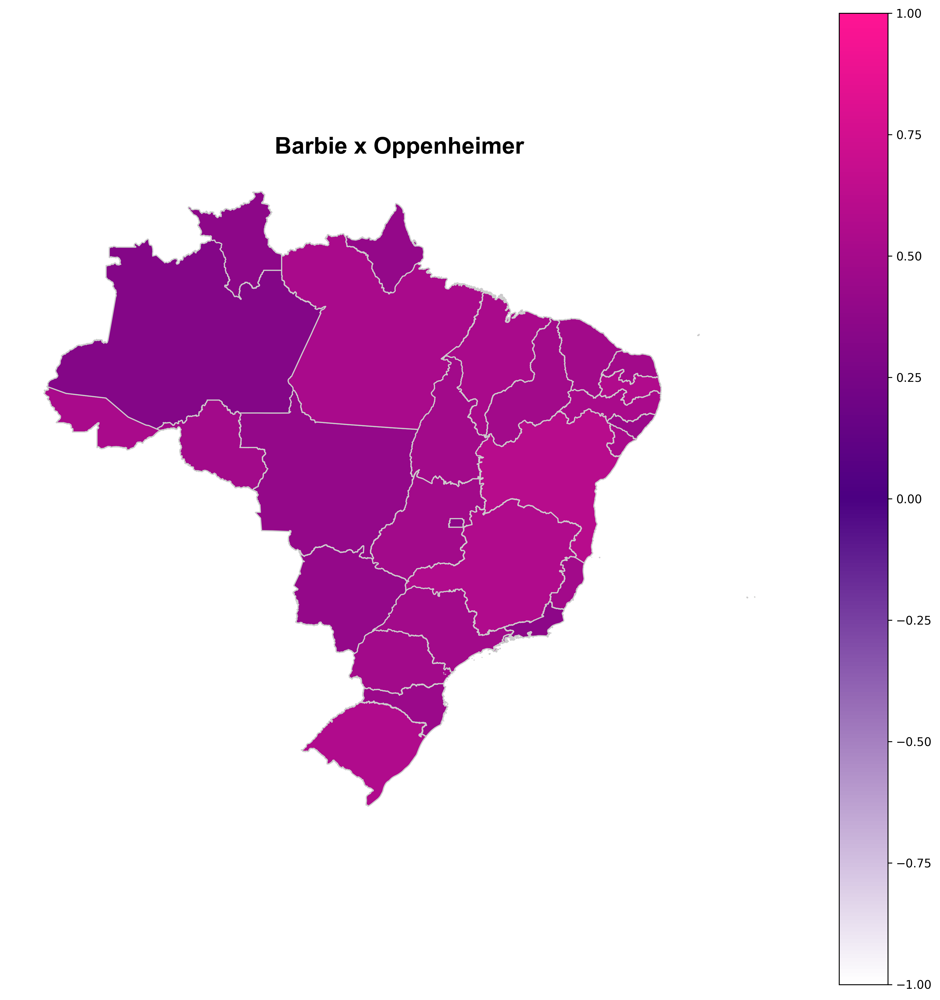

# Projeto de Comparação de Popularidade: Barbie vs. Oppenheimer

Este projeto tem como objetivo comparar a popularidade de duas palavras-chave, "Barbie" e "Oppenheimer", usando dados do Google Trends. A visualização será feita em um mapa do Brasil, onde a cor de cada estado representará a diferença de popularidade entre as palavras-chave.

## Cores de Representação

Utilizamos uma escala de cores variadas entre rosa e azul para representar a popularidade relativa. Os estados mais próximos de 1 terão uma cor mais rosa, indicando uma maior popularidade de "Barbie". Os estados mais próximos de 0 terão uma cor mais azul, mostrando uma popularidade equilibrada entre as duas palavras-chave. Já os estados mais próximos de -1 terão uma cor mais branca, indicando uma maior popularidade de "Oppenheimer".

## Passos do Projeto

1. Coleta de Dados: Utilizamos a biblioteca Pytrends para obter os dados de tendências de pesquisa para as palavras-chave "Barbie" e "Oppenheimer" em um intervalo de tempo específico.

2. Normalização dos Dados: Para comparar as duas palavras-chave de forma equilibrada, normalizamos os dados entre -1 e 1. O valor -1 representa maior popularidade de "Oppenheimer", 0 representa popularidade equilibrada e 1 representa maior popularidade de "Barbie".

3. Visualização do Mapa: Utilizamos a biblioteca Geopandas para plotar um mapa do Brasil com cada estado colorido de acordo com a popularidade relativa das palavras-chave.

## Resultados

O mapa do Brasil mostrou visualmente a diferença de popularidade entre "Barbie" e "Oppenheimer" em cada estado. Os estados mais rosa indicam maior popularidade de "Barbie", os estados mais azuis indicam uma popularidade equilibrada, e os estados mais brancos indicam maior popularidade de "Oppenheimer".

Abaixo está o mapa resultante:

Neste mapa, podemos observar a variação da popularidade entre as duas palavras-chave em diferentes regiões do Brasil. Isso pode ser útil para entender como as tendências de pesquisa variam entre os estados e quais termos são mais populares em cada região.

**Análise dos Resultados:**

Após a análise dos dados, constatamos que a palavra-chave "Barbie" dominou em todos os estados brasileiros, apresentando maior popularidade em comparação com "Oppenheimer". Em nenhum estado houve equilíbrio entre as duas palavras-chave, indicando uma clara preferência de pesquisa por "Barbie" em todo o país.

Esperamos que esta visualização ajude a entender melhor a popularidade de "Barbie" e "Oppenheimer" no Brasil e ofereça insights valiosos sobre as preferências de pesquisa dos usuários em diferentes partes do país.

